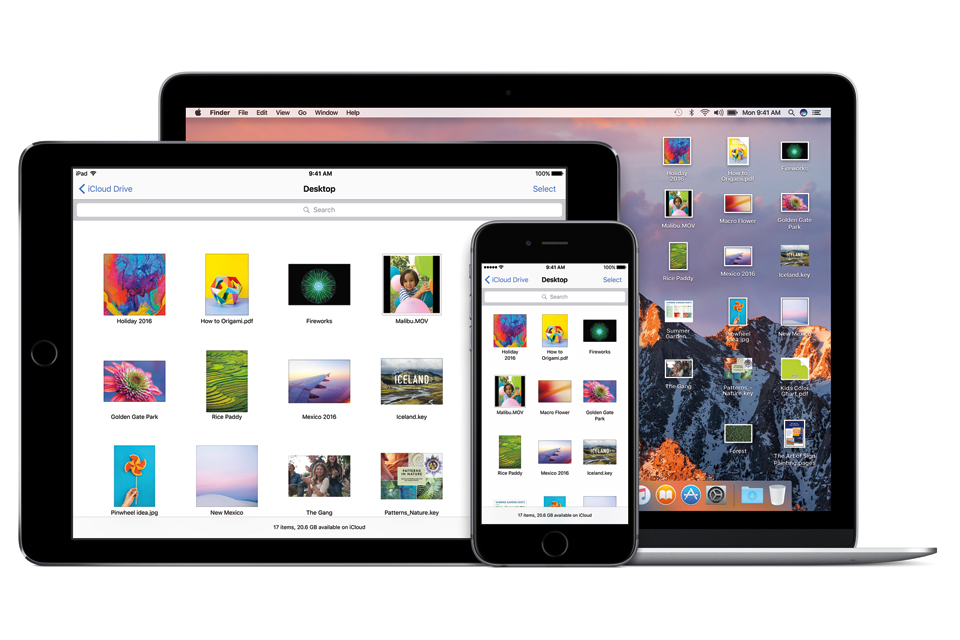

# Terminal? Command line? Shell? Bash?

You may have heard different names for that window with the blinky cursor so let's take a quick step back to understand what the shell is.

## Command-line Interface

Your computer has an operating system that takes care of the thousands of operations per second that your computer does so that you can browse cat pictures online without a hitch. Most operating systems have a fancy *graphical use interface*, or GUI, that you can navigate with your mouse and keyboard and get nice visual feedback in return.

All operating systems come with a text-based *command-line interface*, or shell, to speak to it directly. The shell has a different name depending on your OS. The shell on Windows is called **Command Prompt**, on MacOS it's the **Terminal**, and on Linux it can vary but the most common is **Bash** which comes with Ubuntu.

The shell's main job is to allow you to send commands directly to the operating system, but each OS speaks a slightly different *shell-scripting* language. The one we focus on here is Bash. We chose Bash for a few reasons:

1. Bash is used commonly by scientists, particularly on servers and superclusters, because it is generally more efficient to run light-weight Linux on a server to save room for your precious data.

2. The MacOS terminal is based on Bash, so this whole section should apply to both MacOS and Linux users.

3. The Windows command prompt (and even powershell) is not as powerful when it comes to installing new software and handling file permissions (more on these later).

*Disclaimer*: The MacOS Terminal adds a few features to the plain Bash shell, so not all commands that can be run on a Mac can be transferred to a plain Bash shell.

If your computer is running Windows, learn how to get a bash shell on your computer [here](./windows).
